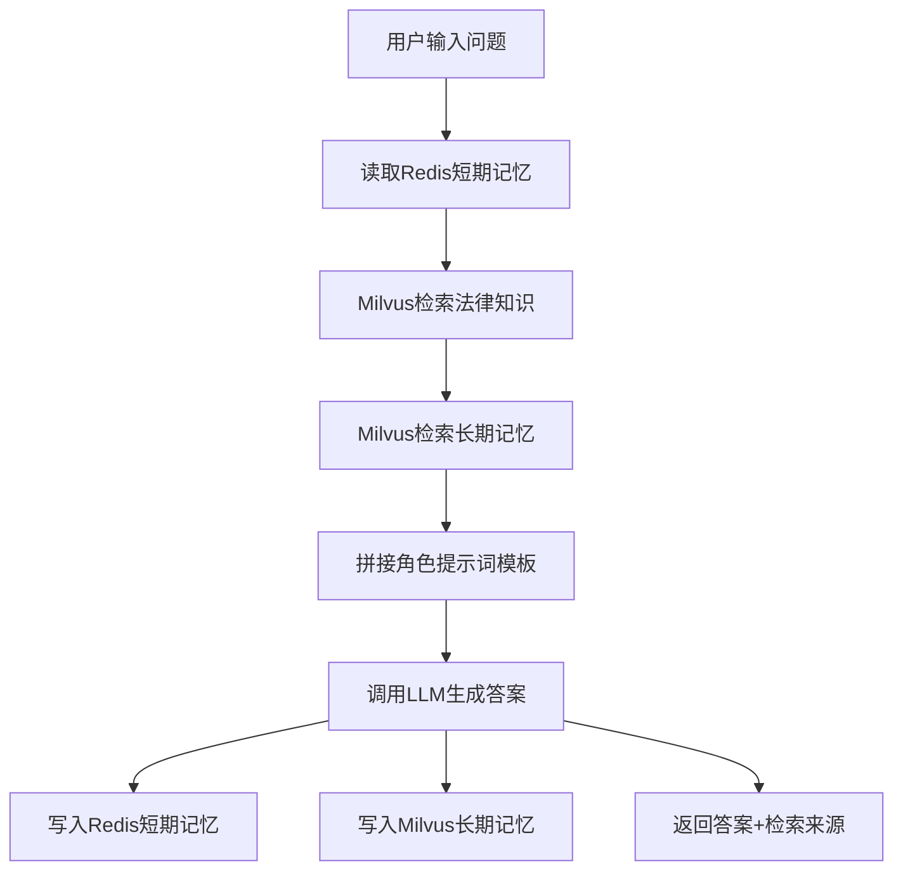

# 角色扮演系统设计文档（RAG 律师助手）

## 1. 技术架构
- 后端框架：FastAPI
- 前端：原生 HTML/CSS/JS
- 向量数据库：Milvus（混合检索，支持 BM25）
- 短期记忆：Redis（会话列表 + 最近消息）
- 长期记忆：Milvus `user_memory` 集合
- 结构化数据：MySQL（用户信息、角色信息）
- 大模型接入：在线 API / 本地推理服务（vLLM、SGLang、xInference）
- Embedding：BGE-m3
- Rerank：BGE-rerank（可配置，降级可用）

## 2. 模块设计
### 2.1 API 层（`main.py`）
- `POST /chat`：核心问答接口。
- `GET /history/{user_id}/{session_id}`：读取短期记忆。
- `GET /sessions/{user_id}`：读取用户会话列表。
- `POST /create_session`：创建会话。
- `POST /clear_session`：清空会话。
- `GET /health`：健康检查。

### 2.2 对话编排层（`chat_service.py`）
- 输入：`user_id`、`session_id`、`message`
- 流程：读取短期记忆 -> RAG 检索 -> 拼装提示词 -> 调用 LLM -> 写入短期/长期记忆 -> 返回答案与来源
- 安全策略：LLM API Key 通过环境变量注入，不落盘。

### 2.3 检索层（`rag_retriever.py`）
- 主检索：BGE-m3 编码后在 Milvus 稠密向量检索。
- 混合能力：Milvus 端已创建 `sparse_vector` 与 BM25 函数，可扩展为真混合检索。
- 重排序：可加载 BGE-rerank 路径并对候选文档二次排序。

### 2.4 记忆层（`memory.py`）
- Redis 短期记忆：按 `user_id + session_id` 隔离，支持 TTL 与会话集合。
- Milvus 长期记忆：存储用户长期偏好/历史信息，支持向量召回。

### 2.5 数据层（MySQL）
- `users`：用户基础信息。
- `roles`：角色定义与提示词模板。
- `user_roles`：用户与角色绑定关系。
- `kb_documents`：知识库文档元数据（原文路径、版本、更新时间）。

## 3. 业务流程

## 4. 业务规则
- BR-01：所有法律建议均附带免责声明。
- BR-02：系统优先引用检索命中的法律条文与司法解释。
- BR-03：按用户与会话隔离短期记忆，禁止串会话污染。
- BR-04：当 Redis 不可用时，启用进程内降级缓存。
- BR-05：当 Reranker 未加载成功时，系统自动降级为仅向量检索。

## 5. 部署建议
- Milvus 建议部署 Linux 环境，启用混合检索与索引持久化。
- Redis 与 MySQL 独立部署，启用密码与网络白名单。
- LLM 提供统一适配层，支持在线 API 与本地推理后端切换。
